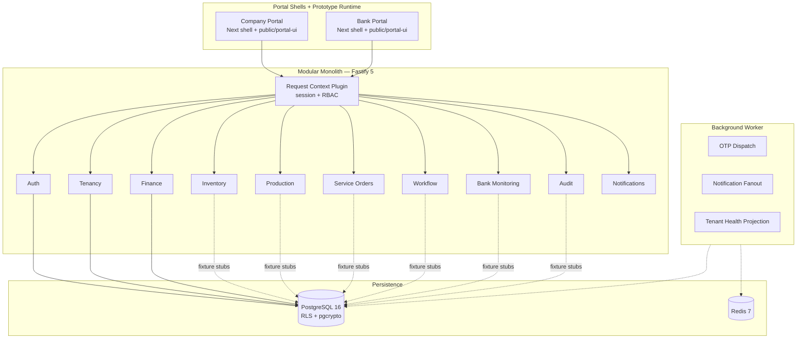
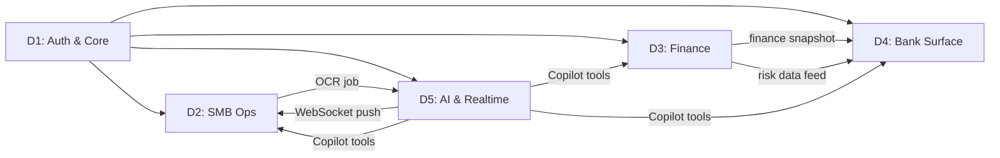

# SQB Business OS — Developer Guide

> **Last updated**: 2026-04-26 (portal-ui reliability + auth stability updates)
> **Team size**: 5 developers (D1–D5)
> **Runtime**: Node.js 20+ · TypeScript 5.7+ (platform-api currently 6.x) · PostgreSQL 16 / Supabase Postgres / self-hosted Postgres · Redis 7 · MinIO

---

## Table of Contents

1. [System Architecture](#system-architecture)
2. [Workspace Layout](#workspace-layout)
3. [Shared Conventions](#shared-conventions)
4. [D1 — Auth & Core Infrastructure](#d1--auth--core-infrastructure)
5. [D2 — SMB Operations](#d2--smb-operations)
6. [D3 — Finance Suite](#d3--finance-suite)
7. [D4 — Credit & Bank Surface](#d4--credit--bank-surface)
8. [D5 — AI Copilot & Real-time Layer](#d5--ai-copilot--real-time-layer)
9. [Overall Completion Summary](#overall-completion-summary)
10. [Cross-Track Dependencies](#cross-track-dependencies)
11. [Sprint Plan](#sprint-plan)

---

## System Architecture



**Why a modular monolith?** Simpler deployment for the hackathon; modules are isolated enough to extract into microservices later if needed. Each module registers its own Fastify routes via a plugin function and owns its own `store.ts` for DB persistence.

**Frontend contract:** both portals are portal-ui-first. `public/portal-ui/` is the primary authenticated UI. `app/` is only the Next.js host layer for auth pages, middleware, route protection, global bootstrapping, and `app/api/*` BFF routes that call `services/platform-api`.

---

## Workspace Layout

| Path | Purpose | Package |
|------|---------|---------|
| `apps/company-portal/` | SMB portal shell plus portal UI runtime; `app/` hosts auth/BFF, `public/portal-ui/` owns authenticated UI | `@sqb/company-portal` |
| `apps/bank-portal/` | Bank portal shell plus portal UI runtime; `app/` hosts auth/BFF, `public/portal-ui/` owns authenticated UI | `@sqb/bank-portal` |
| `services/platform-api/` | Fastify modular monolith — all tenant-aware APIs | `@sqb/platform-api` |
| `services/worker/` | Background jobs (OTP, notifications, projections) | `@sqb/worker` |
| `packages/domain-types/` | Shared TypeScript interfaces and enums | `@sqb/domain-types` |
| `packages/api-client/` | Typed fetch client used by both portals | `@sqb/api-client` |
| `packages/config/` | Environment parsing (`loadEnv()`), logger factory | `@sqb/config` |
| `packages/ui/` | Shared UI primitives (KpiCard, DataTable, StatusBadge) | `@sqb/ui` |
| `db/migrations/` | Sequential SQL migrations (001–015, including two `014_*` files) | — |
| `db/seeds/` | Seed data for local development | — |
| `infra/docker/` | Docker Compose (Redis 7 + optional local Postgres 16 for self-hosted dev) | — |

### Portal folder rules

- `app/(auth)/*` is for login, OTP, terms, forgot-password, and other public auth screens.
- `app/api/*` is the portal-local BFF layer; browser code should use these routes instead of calling `services/platform-api` directly.
- `public/portal-ui/` is the main product UI for authenticated portal routes.
- `src/lib/*` contains middleware, routing, session, and navigation helpers.
- `src/features/auth/*` may exist for auth-only composition, but product screens should not be rebuilt under `src/features/*` or `app/app/*` when a portal-UI-owned route already exists.

---

## Shared Conventions

> **ALL five developers must agree on these on Day 1.**

### API Response Envelope

Every endpoint must use this format:

```typescript
// Success
{ data: T, meta?: { page, pageSize, total } | null, error: null }

// Error
{ data: null, meta: null, error: { message: string, errorCode: string | null } }
```

Helper functions are in `services/platform-api/src/lib/envelope.ts`:
- `ok(data)` — wrap a successful response
- `paginated(data, page, pageSize, total)` — wrap a paginated list
- `fail(message, errorCode?)` — wrap an error

### Authentication Flow

```
1. POST /auth/login/password  →  returns AuthChallenge (OTP pending)
2. POST /auth/otp/verify      →  returns AuthSession with sessionToken
3. All subsequent requests     →  x-session-token header
4. Request context plugin      →  extracts session, populates request.context
```

### Tenant Isolation

- **Row-Level Security (RLS)** on all tenant-scoped tables
- `app.tenant_id` PostgreSQL session variable set per request
- `x-tenant-id` header for unauthenticated fallback contexts

### Roles & Permissions

| Role | Portal | Access Level |
|------|--------|-------------|
| `super_admin` | Bank | Full platform, break-glass access |
| `bank_admin` | Bank | Portfolio monitoring, audit read |
| `company_admin` | Company | Full tenant management |
| `employee` | Company | Operational access (inventory, service orders) |

### Input Validation

All mutation endpoints must use **Zod schemas** (see `services/platform-api/src/modules/finance/validation.ts` for the pattern). Use `parseOrThrow(schema, body)` to validate — it returns a clean 400 error with field path.

### Database Access

Use `withDb()` from `services/platform-api/src/lib/db.ts`. It handles connection pooling, supports Supabase pooler/direct DSNs or standard Postgres DSNs, and can fall back to in-memory stubs when `ALLOW_DEMO_AUTH=true` and PostgreSQL is unavailable.

---

## Recent Updates (2026-04-26)

### Auth/session stability on route changes

- Fixed forced logout behavior when switching sections during transient auth API failures.
- `/api/auth/session` 5xx/network failures are treated as transient on the portal UI side.
- Middleware refresh failures now return `unavailable` on 5xx/network failures instead of invalidating auth state.
- Updated files:
  - `apps/company-portal/public/portal-ui/src/auth.jsx`
  - `apps/company-portal/public/portal-ui/index.html`
  - `apps/company-portal/middleware.ts`
  - `apps/bank-portal/public/portal-ui/src/auth.jsx`
  - `apps/bank-portal/public/portal-ui/index.html`
  - `apps/bank-portal/middleware.ts`

### Finance surface reliability

- Cash flow view now always normalizes to 6 monthly buckets (zero-filled gaps) to avoid one-bar stretch and unstable KPI presentation.
- General ledger mock fallback balances were removed; ledger now renders only live data with explicit loading/empty states.
- Updated file:
  - `apps/company-portal/public/portal-ui/src/smb-rest.jsx`

### Dashboard actionability

- `Activity` and `Needs attention` panels now use live backend data with explicit `actionPath` and clickable row routing.
- Updated files:
  - `apps/company-portal/app/api/dashboard/overview/route.ts`
  - `apps/company-portal/public/portal-ui/src/smb-hero.jsx`

---

## D1 — Auth & Core Infrastructure

**Owner**: Developer 1
**Priority**: 🔴 CRITICAL PATH — everyone is blocked until D1 ships auth middleware + tenant model

### Role Description

D1 is the critical path. This person starts on day 1 and everyone else is blocked until they ship the auth middleware, tenant model, and base app structure. They own the PostgreSQL schema setup. The `withDb()` helper, request context plugin, and error handling plugin are their responsibility.

### ✅ What's Done

| Deliverable | Files |
|------------|-------|
| Fastify app scaffold with plugin system | `services/platform-api/src/app.ts` |
| Request context plugin (session extraction + RBAC) | `services/platform-api/src/plugins/context.ts` |
| Error handling plugin | `services/platform-api/src/plugins/errors.ts` |
| Password login with lockout protection | `services/platform-api/src/modules/auth/store.ts` |
| OTP challenge (SMS via Twilio + TOTP app) | `services/platform-api/src/modules/auth/sms-provider.ts`, `totp.ts` |
| Session management (create, validate, revoke) | `auth/store.ts` |
| Terms of service acceptance flow | `auth/store.ts` |
| Tenant model + workspace onboarding | `services/platform-api/src/modules/tenancy/` |
| Workspace conflict detection (slug, TIN, name) | `tenancy/store.ts` |
| DB migrations 001–015 (schema, auth, onboarding, profiles, OTP, refresh tokens, workspace access control, session activity, bank surface, inventory unit cost patch) | `db/migrations/*.sql` |
| RLS policies on all tenant-scoped tables | `db/migrations/001_initial_schema.sql` |
| Domain types: platform contracts | `packages/domain-types/src/platform.ts` |
| Docker Compose (Redis 7 + optional local Postgres 16 for self-hosted dev) | `infra/docker/docker-compose.yml` |
| Environment config + logger | `packages/config/src/` |
| Frontend auth flow (login, OTP, terms, forgot) | Both portals: `app/(auth)/` |
| **JWT access tokens** — HS256 signed, stateless verification, JTI stored in DB for revocability | `services/platform-api/src/lib/jwt.ts`, `auth/store.ts` |
| **Refresh token rotation** — opaque tokens, SHA-256 hash in DB, rotate on use, revoke on logout/password change | `db/migrations/010_refresh_tokens.sql`, `auth/store.ts`, `auth/index.ts` |
| **Rate limiting** — global 100 req/min, auth routes 20 req/min, sensitive routes 10 req/min | `app.ts` (`@fastify/rate-limit`) |
| **CORS hardening** — `ALLOWED_ORIGINS` env whitelist, replaces `origin: true` | `app.ts`, `packages/config/src/env.ts` |
| **Password reset consume** (`POST /auth/password/reset/consume`) — verifies token, updates password, revokes all sessions | `auth/store.ts`, `auth/index.ts`, portal route handlers |
| **Invite acceptance** (`POST /auth/invites/:token/accept`) — creates user + credentials + membership from invitation | `db/migrations/011_invite_accept_token.sql`, `tenancy/store.ts`, `tenancy/index.ts` |
| **Workspace access control model** — workspace roles (`owner`, `company_admin`, `manager`, `operator`) plus permission groups on memberships and invitations | `db/migrations/012_workspace_access_control.sql`, `packages/domain-types/src/access-control.ts`, `tenancy/store.ts` |
| **Session activity tracking** — `sessions.last_seen_at` captured for session views and revocation UX | `db/migrations/013_session_last_seen.sql`, `auth/store.ts` |
| **Privileged-account TOTP override** — dedicated non-break-glass privileged accounts can disable mandatory TOTP when policy allows | `db/migrations/009_super_admin_totp_toggle.sql`, `auth/store.ts`, `auth/index.ts` |
| **Session cleanup** — `cleanExpiredSessions()` runs every 15 min via `setInterval` in server | `auth/store.ts`, `server.ts` |
| **Break-glass audit trail** — break-glass sessions emit `auth.break_glass` category in audit events | `auth/store.ts`, `domain-types/src/platform.ts` |
| **`AuthErrorCode` type** — centralized in `domain-types`, used throughout auth module | `packages/domain-types/src/platform.ts` |
| **`erp_auth_refresh` cookie** — httpOnly refresh token set on login/OTP verify, used by `/api/auth/token/refresh` | Both portal route handlers |
| **Silent token refresh in middleware** — when JWT expires, middleware silently rotates via refresh token before redirecting to login | Both portals `middleware.ts` |
| **`GET /audit/break-glass`** — super_admin-only endpoint returning break-glass session events | `services/platform-api/src/modules/audit/index.ts` |

### 🔲 What's Remaining

D1 is complete. No outstanding tasks.

---

## D2 — SMB Operations

**Owner**: Developer 2
**Priority**: Core ERP functionality — inventory, production, BOM, Kanban

### Role Description

D2 covers the "physical" side of the business: inventory, production, BOM, and the Kanban board. The OCR waybill scanning is the trickiest piece — use a BullMQ background job so the upload endpoint returns immediately and the result is pushed via WebSocket (from D5) when processing completes. Coordinate with D5 for the WebSocket push channel.

### ✅ What's Done

| Deliverable | Files |
|------------|-------|
| DB schema: `warehouses`, `inventory_items`, `stock_movements`, `stocktakes` | `db/migrations/001_initial_schema.sql` (L60-116) |
| DB schema: `production_boms`, `production_orders`, `scrap_records` | `db/migrations/001_initial_schema.sql` (L118-159) |
| DB schema: `service_orders`, `approvals` | `db/migrations/001_initial_schema.sql` (L161-188) |
| RLS policies for all operations tables | `db/migrations/001_initial_schema.sql` (L200-227) |
| API route stubs (read-only, fixture-backed) | `services/platform-api/src/modules/inventory/`, `production/`, `service-orders/` |
| Portal UI surfaces | `apps/company-portal/public/portal-ui/src/` plus company `app/api/*` BFF routes |

### 🔲 What's Remaining

| Task | Priority | Notes |
|------|----------|-------|
| **Inventory CRUD** — full create/update/delete for items, warehouses | 🔴 High | Currently fixture-only `GET /inventory/summary` |
| **Stock movement recording** — inbound, outbound, transfer, adjustment | 🔴 High | Schema exists, no API endpoints |
| **BOM CRUD** — create/update bill of materials with versioning | 🔴 High | Schema exists, no API |
| **Production order lifecycle** — planned → in_progress → completed/blocked | 🔴 High | Schema exists, no API |
| **Replace all fixture data with DB queries** | 🔴 High | All reads return hardcoded fixtures |
| **Stocktake management** — initiate, record counts, calculate variance | 🟡 Medium | Schema exists, no API |
| **Scrap recording** — log scrap against production orders | 🟡 Medium | Schema exists, no API |
| **Kanban board API** — status transitions, drag-drop state | 🟡 Medium | No schema or API |
| **OCR waybill scanning** — upload + BullMQ background job | 🟡 Medium | No implementation; push result via D5 WebSocket |
| **Service order lifecycle** — submit → approve → in_progress → complete | 🟡 Medium | Schema exists, no mutation API |
| **Approval workflow engine** — generic entity approval with role checks | 🟡 Medium | `approvals` table exists, no API beyond `GET /workflows/pending` |
| **Input validation** (Zod schemas for all mutations) | 🟡 Medium | Follow the pattern in `finance/validation.ts` |

---

## D3 — Finance Suite

**Owner**: Developer 3
**Priority**: Most technically precise module — double-entry ledger, invoices, bills, payments

### Role Description

D3 is the most technically precise module. Double-entry ledger logic requires care — `decimal.js` is already integrated to avoid floating-point issues. The PDF invoice generator and the cash flow aggregation query are the two hardest deliverables. This dev should coordinate with D4 since the financial data feeds directly into the risk scoring engine via `getTenantFinanceSnapshot()`.

### ✅ What's Done

| Deliverable | Files | LOC |
|------------|-------|-----|
| Full finance DB schema (accounts, journals, invoices, bills, payments, allocations) | `db/migrations/007_finance_core.sql` | 197 |
| RLS policies for all finance tables | `db/migrations/008_finance_rls.sql` | 57 |
| Double-entry journal engine with batch balance validation | `services/platform-api/src/modules/finance/store.ts` → `createBatch()` | ~2030 |
| `decimal.js` for all monetary calculations | Used throughout `finance/store.ts` | — |
| Default chart of accounts (10 system accounts seeded per tenant) | Migration 007 + `seedDefaultFinanceAccountsForTenant()` | — |
| Invoice lifecycle: create (draft) → issue → record payment → void | Full CRUD in `store.ts` | — |
| Bill lifecycle: create (draft) → post → record payment → void | Full CRUD in `store.ts` | — |
| Manual journal entries | `createManualJournal()` | — |
| Cash flow aggregation (monthly buckets) | `getCashFlow()` | — |
| Counterparty management (auto-upsert, list, detail) | `upsertCounterparty()`, `listCounterparties()`, `getCounterparty()` | — |
| Ledger entry listing with pagination + filters | `listLedgerEntries()` | — |
| Payment listing with filters | `listPayments()` | — |
| Finance snapshot for bank view | `getTenantFinanceSnapshot()` | — |
| Invoice/Bill voiding with reversal journals | `voidInvoice()`, `voidBill()` | — |
| PDF generation (invoice + bill) | `services/platform-api/src/modules/finance/pdf.ts` | — |
| Financial reports (Trial Balance, P&L, Balance Sheet) | `services/platform-api/src/modules/finance/reports.ts` | — |
| Zod input validation for all mutations | `services/platform-api/src/modules/finance/validation.ts` | — |
| Standardized response envelope | `services/platform-api/src/lib/envelope.ts` | — |
| Domain types: complete finance contracts | `packages/domain-types/src/finance.ts` (221 LOC) | — |
| Role-based access control (company write, bank read-only) | Route-level guards in `finance/index.ts` | — |
| Finance portal UI surface + BFF routes | `apps/company-portal/public/portal-ui/src/`, `apps/company-portal/app/api/` | — |

### 🔲 What's Remaining

| Task | Priority | Notes |
|------|----------|-------|
| **Multi-currency support** (beyond UZS) | 🟡 Medium | Hardcoded to `UZS` with explicit check constraint |
| **Recurring invoices/bills** | 🟢 Low | No schema or API |
| **Tax report generation** | 🟢 Low | Tax data tracked per line but no summary report endpoint |
| **Batch payment import** | 🟢 Low | — |
| **Finance → D4 automated risk data feed** | 🟡 Medium | `getTenantFinanceSnapshot` exists but no automated push |

---

## D4 — Credit & Bank Surface

**Owner**: Developer 4
**Priority**: Bank-facing backend — portfolio monitoring, credit queue, risk scoring, audit log

### Role Description

D4 owns the entire bank-facing interface on the backend. The audit log is best implemented as an append-only Postgres table with a trigger or middleware that auto-logs every mutation — it should never be writable by the application layer directly. The risk scoring engine can start as a rule-based system (debt ratio thresholds, revenue stability) and later be swapped for an ML model. Coordinate with D3 for the finance snapshot data feed.

### ✅ What's Done

| Deliverable | Files |
|------------|-------|
| DB schema: append-only `audit_events` hardening + indexes | `db/migrations/014_bank_surface_d4.sql`, `services/platform-api/src/modules/audit/store.ts` |
| DB schema: enriched `bank_tenant_health` projection table | `db/migrations/014_bank_surface_d4.sql`, `services/platform-api/src/modules/bank-monitoring/store.ts` |
| DB schema: `credit_applications`, `credit_decisions`, `credit_application_documents` | `db/migrations/014_bank_surface_d4.sql` |
| Auth + bank audit events persisted through shared audit writer | `services/platform-api/src/modules/audit/store.ts`, `auth/store.ts`, `audit/index.ts` |
| Bank portfolio endpoint backed by stored projections | `services/platform-api/src/modules/bank-monitoring/` |
| Portfolio analytics endpoint | `GET /bank/portfolio/analytics` |
| Credit queue APIs: list, detail, assign, decision | `GET/POST /bank/credit-queue*` in `services/platform-api/src/modules/bank-monitoring/index.ts` |
| Finance snapshot for bank view | `GET /finance/snapshot/:tenantId` (built by D3) |
| Worker projection refresh job populating tenant health read model | `services/worker/src/jobs/projection-job.ts` |
| Bank portal proxy routes for audit, analytics, portfolio, and credit queue data | `apps/bank-portal/app/api/` |
| Bank portal UI surface + BFF routes wired to live APIs | `apps/bank-portal/public/portal-ui/src/`, `apps/bank-portal/app/api/` |
| Domain types: audit, bank analytics, credit queue contracts | `packages/domain-types/src/platform.ts`, `packages/domain-types/src/bank.ts` |

### 🔲 What's Remaining

| Task | Priority | Notes |
|------|----------|-------|
| **Append-only audit log via DB trigger** | ✅ Done | `audit_events` now rejects updates/deletes and uses indexed DB reads |
| **Projection-backed bank read model** | ✅ Done | `/bank/portfolio` reads from `bank_tenant_health`; worker refresh persists score factors, recommendation, and refresh timestamps |
| **Risk scoring engine (rule-based)** | ✅ Done | v1 scoring rules implemented from finance snapshot inputs with stored factor breakdown |
| **Credit queue management** — review, approve, reject applications | ✅ Done | Credit queue persistence, detail view, assignment, and decision endpoints are live |
| **Tenant health projection (worker job)** | ✅ Done | `projection-job.ts` refreshes and upserts bank-facing tenant health projections |
| **Portfolio analytics** — aggregate metrics across all tenants | ✅ Done | `/bank/portfolio/analytics` returns counts, averages, risk buckets, recommendations, and SLA health |
| **Audit log search/filter API** | ✅ Done | `GET /audit/events` supports category, actorRole, tenantId, text, date range, and limit filters |
| **Hook bank UI screens to live bank APIs** | ✅ Done | Dashboard, tenants, credit queue, and audit screens now use `/api/bank/*` and `/api/audit/events` |
| **Compliance reporting** | 🟡 Medium | — |
| **Risk score history tracking** | 🟢 Low | — |
| **ML model interface for risk scoring** (future swap) | 🟢 Low | Design rule-based engine with clean interface for future ML swap |

---

## D5 — AI Copilot & Real-time Layer

**Owner**: Developer 5
**Priority**: WebSocket server, BullMQ job queue, AI Copilot, real-time notifications

### Role Description

D5 can start in parallel early on by building the WebSocket server and job queue infrastructure, then integrate with other modules as they become available. The Copilot system prompt should be **surface-aware**: the SMB variant gets access to inventory/finance tools, the Bank variant gets access to portfolio and credit queue data. Coordinate with D2 for OCR waybill result push.

### ✅ What's Done

| Deliverable | Files |
|------------|-------|
| Worker service scaffold | `services/worker/src/index.ts` |
| OTP + notification job stubs | `services/worker/src/jobs/otp-job.ts`, `notification-job.ts` |
| Tenant health projection refresh job | `services/worker/src/jobs/projection-job.ts` |
| Redis defined in docker-compose | `infra/docker/docker-compose.yml` |
| Notifications health endpoint | `GET /notifications/health` |

### 🔲 What's Remaining

| Task | Priority | Notes |
|------|----------|-------|
| **WebSocket server** (Socket.io or ws) | 🔴 High | No WebSocket implementation anywhere in the codebase |
| **BullMQ integration** | 🔴 High | `bullmq` package is available in API dependencies; worker queue wiring and processors are still pending |
| **Real-time event broadcasting** (order updates, financial events) | 🔴 High | Depends on WebSocket server |
| **AI Copilot backend** — surface-aware prompt system | 🔴 High | No implementation |
| **OCR waybill processing job** (from D2) | 🟡 Medium | BullMQ job that processes upload, pushes result via WebSocket |
| **SMB Copilot variant** — inventory/finance tools | 🟡 Medium | Depends on Copilot backend |
| **Bank Copilot variant** — portfolio/credit queue data | 🟡 Medium | Depends on Copilot backend |
| **Implement OTP dispatch job** (replace stub) | 🟡 Medium | Currently a no-op |
| **Implement notification fanout job** (replace stub) | 🟡 Medium | Currently a no-op |
| **Implement tenant health projection job** (replace stub) | ✅ Done | Refreshes D4 projection-backed bank portfolio read model |
| **In-app notification persistence and delivery** | 🟡 Medium | No schema for notifications table |
| **Email notification channel** | 🟢 Low | — |

---

## Overall Completion Summary

```
D1 ██████████████████████ 100%   Auth & Core Infrastructure
D2 ██░░░░░░░░░░░░░░░░░░░ ~10%   SMB Operations
D3 ███████████████████░ ~95%   Finance Suite
D4 ██████████████████░░░ ~80%   Credit & Bank Surface
D5 █░░░░░░░░░░░░░░░░░░░░ ~5%    AI Copilot & Real-time
```

---

## Cross-Track Dependencies



| Dependency | From → To | What |
|-----------|-----------|------|
| Auth middleware | D1 → ALL | Everyone needs `request.context` with session + RBAC |
| DB schema | D1 → ALL | Base tables (tenants, users, memberships) are used everywhere |
| Finance snapshot | D3 → D4 | `getTenantFinanceSnapshot()` feeds bank portfolio and risk engine |
| WebSocket push | D5 → D2 | OCR waybill result pushed to client via WebSocket |
| OCR job enqueue | D2 → D5 | D2 creates the upload endpoint, D5 runs the BullMQ job |
| Copilot tool access | D5 → D2, D3, D4 | Copilot calls store functions from other modules |

---

## Sprint Plan

| Phase | Days | Focus |
|-------|------|-------|
| **Phase 1** | Days 1–2 | D1 ships JWT tokens, refresh rotation, rate limiting. D5 sets up WebSocket + BullMQ infra. All 5 devs agree on response envelope + error codes |
| **Phase 2** | Days 2–5 | D2, D3, D4 run in parallel. D2 builds inventory/production CRUD. D3 finishes finance APIs and portal UI integration. D4 builds risk engine + audit triggers |
| **Phase 3** | Days 5–7 | D5 integrates real-time events from D2/D3/D4. Copilot backend with surface-aware prompts. All tracks do integration testing |

---

## Key Technical Decisions

| Decision | Rationale |
|----------|-----------|
| **Fastify modular monolith** (not microservices) | Simpler deployment for hackathon scope; modules can be extracted later |
| **PostgreSQL RLS** for tenant isolation | Database-level security — app bugs can't leak tenant data |
| **`decimal.js`** for finance | Avoids IEEE 754 floating-point errors in monetary calculations |
| **`pdfkit`** for PDF generation | Lightweight, stream-based, no browser dependency |
| **In-memory + DB dual-path auth** | Demo accounts work without DB; production accounts use full persistence |
| **BullMQ** for background jobs | Redis-backed, reliable job queue with retry/backoff |
| **Zod** for input validation | Runtime type safety with clean error messages |
| **Surface-aware Copilot prompts** | SMB variant gets inventory/finance tools; Bank variant gets portfolio/credit data |

---

## File Inventory by Track

### D1 — Auth & Core

```
services/platform-api/src/app.ts
services/platform-api/src/server.ts
services/platform-api/src/plugins/context.ts
services/platform-api/src/plugins/errors.ts
services/platform-api/src/modules/auth/index.ts
services/platform-api/src/modules/auth/store.ts
services/platform-api/src/modules/auth/sms-provider.ts
services/platform-api/src/modules/auth/totp.ts
services/platform-api/src/modules/tenancy/index.ts
services/platform-api/src/modules/tenancy/store.ts
services/platform-api/src/lib/db.ts
services/platform-api/src/lib/envelope.ts
services/platform-api/src/lib/fixtures.ts
services/platform-api/src/types/context.ts
packages/domain-types/src/platform.ts
packages/config/src/*
db/migrations/001_initial_schema.sql
db/migrations/002_auth_identity.sql
db/migrations/003_workspace_onboarding.sql
db/migrations/004_user_email_and_tenant_profiles.sql
db/migrations/005_otp_methods_and_pgcrypto.sql
db/migrations/006_sms_provider_normalization.sql
```

### D2 — SMB Operations

```
services/platform-api/src/modules/inventory/index.ts
services/platform-api/src/modules/production/index.ts
services/platform-api/src/modules/service-orders/index.ts
services/platform-api/src/modules/workflow/index.ts
packages/domain-types/src/inventory.ts
packages/domain-types/src/production.ts
packages/domain-types/src/service-orders.ts
db/migrations/001_initial_schema.sql  (warehouse/inventory/production tables)
apps/company-portal/public/portal-ui/src/
apps/company-portal/app/api/
apps/company-portal/middleware.ts
```

### D3 — Finance Suite

```
services/platform-api/src/modules/finance/index.ts
services/platform-api/src/modules/finance/store.ts
services/platform-api/src/modules/finance/reports.ts
services/platform-api/src/modules/finance/pdf.ts
services/platform-api/src/modules/finance/validation.ts
packages/domain-types/src/finance.ts
db/migrations/007_finance_core.sql
db/migrations/008_finance_rls.sql
apps/company-portal/public/portal-ui/src/
apps/company-portal/app/api/
```

### D4 — Credit & Bank Surface

```
services/platform-api/src/modules/bank-monitoring/index.ts
services/platform-api/src/modules/audit/index.ts
packages/domain-types/src/bank.ts
db/migrations/001_initial_schema.sql  (audit_events, bank_tenant_health tables)
apps/bank-portal/public/portal-ui/src/
apps/bank-portal/app/api/
apps/bank-portal/middleware.ts
```

### D5 — AI & Real-time

```
services/worker/src/index.ts
services/worker/src/jobs/otp-job.ts
services/worker/src/jobs/notification-job.ts
services/worker/src/jobs/projection-job.ts
services/platform-api/src/modules/notifications/index.ts
infra/docker/docker-compose.yml  (Redis)
```

---

## Getting Started

```bash
# 1. Copy environment values
cp .env.example .env

# 2. Edit DATABASE_URL and DIRECT_DATABASE_URL
# Supabase option:
# DATABASE_URL for app/runtime traffic:
# postgresql://postgres.<project-ref>:<url-encoded-password>@aws-0-<region>.pooler.supabase.com:5432/postgres?sslmode=require
# DIRECT_DATABASE_URL for migrations/manual SQL:
# postgresql://postgres:<url-encoded-password>@db.<project-ref>.supabase.co:5432/postgres?sslmode=require
#
# Self-hosted PostgreSQL option:
# DATABASE_URL=postgresql://<user>:<url-encoded-password>@<host>:5432/<database>
# DIRECT_DATABASE_URL=postgresql://<user>:<url-encoded-password>@<host>:5432/<database>
# Keep PLATFORM_API_URL and NEXT_PUBLIC_API_URL pointed at the local API.
# NEXT_PUBLIC_SUPABASE_URL and NEXT_PUBLIC_SUPABASE_PUBLISHABLE_KEY are currently not used.

# 3. Start optional local infrastructure
docker compose -f infra/docker/docker-compose.yml up -d
# Redis and MinIO are still local. The bundled local Postgres is optional when Supabase is used.

# 4. Run migrations against the configured database
npm run db:migrate --workspace @sqb/platform-api
# or apply db/migrations/*.sql manually against the configured database in order through 015 (including both 014_* files)

# 5. Start the API
npm run dev --workspace @sqb/platform-api

# 6. Start a portal
npm run dev --workspace @sqb/company-portal
npm run dev --workspace @sqb/bank-portal

# 7. Start the worker
npm run dev --workspace @sqb/worker
```

### Supabase Postgres Notes

- Keep the existing custom login, OTP, refresh-token, and session-cookie flow. This repo does not use Supabase Auth.
- `DATABASE_URL` must be the Supabase Session Pooler URI for runtime app traffic on IPv4-compatible networks.
- `DIRECT_DATABASE_URL` should be the direct database URI used by Prisma migrate and admin SQL tools.
- If the password contains reserved characters, URL-encode them before placing the value in either URI.
- For Supabase hosts, require TLS by keeping `sslmode=require` on both URIs.

### Self-hosted PostgreSQL Notes

- Supabase is optional. Any PostgreSQL server compatible with `pg` and Prisma can be used.
- For self-hosted PostgreSQL, `DATABASE_URL` and `DIRECT_DATABASE_URL` can point at the same server.
- Local Docker Postgres under `infra/docker/docker-compose.yml` remains available for offline or isolated development.
